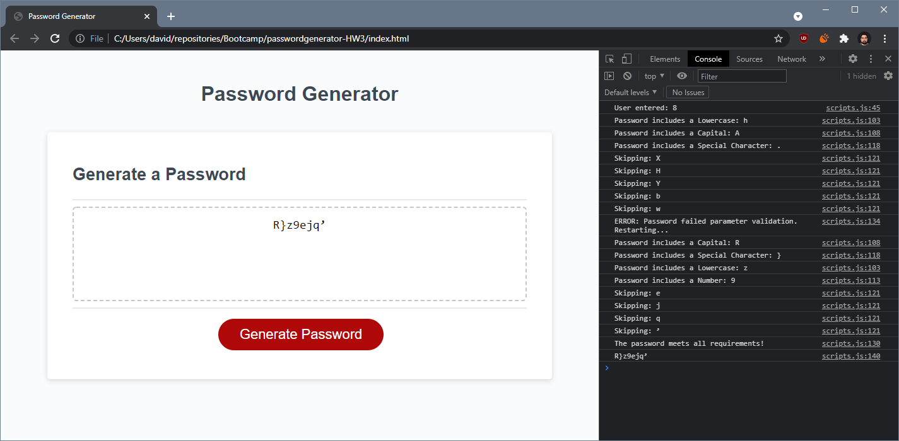

# passwordgenerator-HW3
## HW2 by David Lucio

*JavaScript: Password Generator for UW Bootcamp*

>**UW Bootcamp Homework 03** 
Create a password generator.

- When button is pushed...
  - User is prompted for password length (**X**)

  - User is prompted what type of characters to include (**Y**)

- System takes user input and calls 'generate' function
  - Function compiles list of all possible characters based on **Y**

  - Function chooses random characters from list **X** number of times

  - Function concatonates individual characters into string **Z**

- Validator parses string **Z** to ensure it meets parameters
    - **Z** must be **X** long

    - **Z** must include *at least one* of each type **Y**

    - If it doesn't meet these conditions, 'generate' is run again

- If validator approves password, 'generate' function returns Password

&nbsp;

*Assignment completed 6/24*: [Deployment Link](https://davidlucio.github.io/passwordgenerator-HW3/)

### **Screenshot of completed project:**

**REPO**: https://github.com/davidlucio/passwordgenerator-HW3